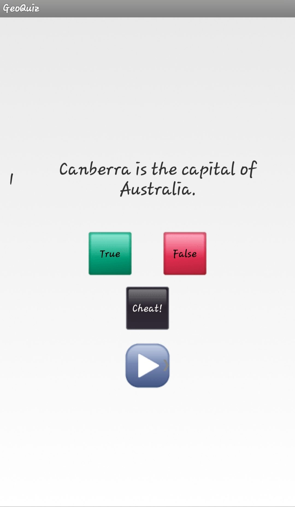
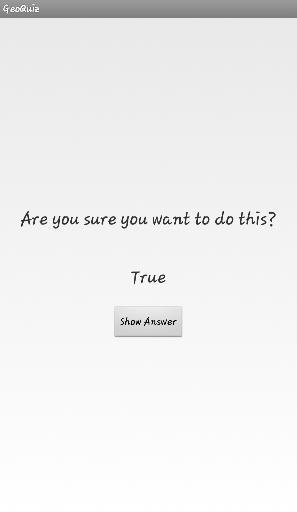
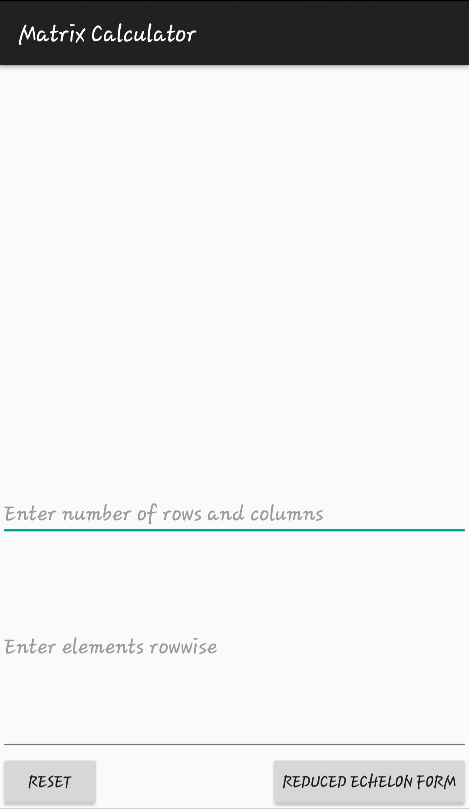
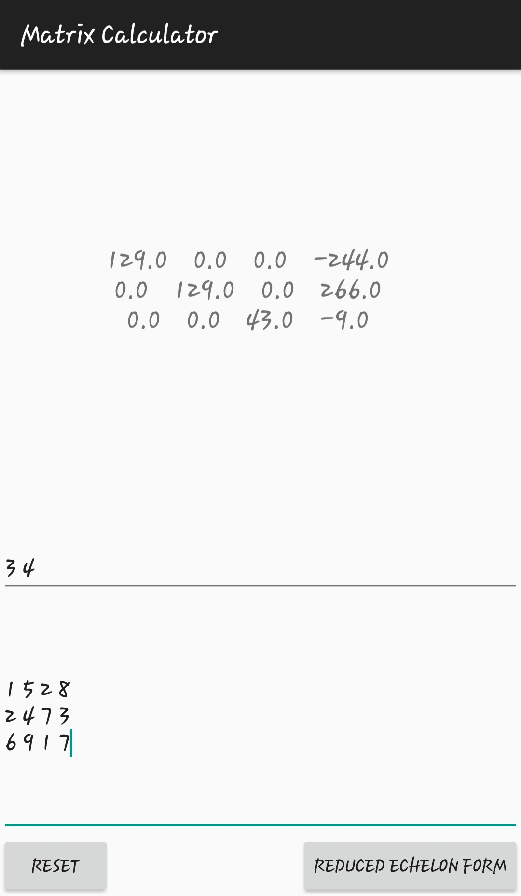

# Apps

## GeoQuiz
A simple Android app that I developed guided by the book "Android Programming (The Big Nerd Ranch Guide)". The app has 6 quiz questions with answers either true or false. When an option is chosen, a toast is generated showing whether the answer is correct or not. There is an additional option "Cheat" that allows the user to sneak into the answer. The user is then asked if he really wants to cheat showing the option "Show Answer". If the user taps it, the answer is displayed.

## Matrix Calculator
An android app that takes input the dimension of the matrix and the matrix entry. The output is the Row Echelon for of the matrix.

